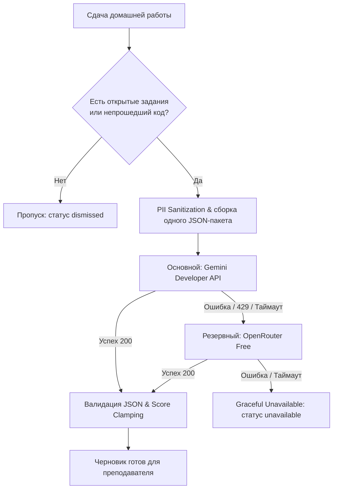

# Безопасная ИИ-предпроверка домашних работ (BooStudy AI Reviewer)

Модуль серверной предварительной проверки домашних заданий ассистентом на базе LLM для платформы BooStudy.

---

## 1. Концепция и цели

ИИ-предпроверка выступает исключительно в роли **ассистента преподавателя**:
1. Формирует предварительный черновик оценки и комментариев до того, как учитель откроет страницу проверки.
2. Экономит время преподавателя на рутинный анализ открытых ответов и разбор кода с ошибками.
3. Подсвечивает типичные ошибки, границы диапазонов и сильные стороны решений.
4. **Никогда** не выставляет оценку напрямую ученику без подтверждения учителем.

---

## 2. Архитектура и правила безопасности

### Детерминированная проверка первой
Все задания с однозначными ответами (тесты, сопоставление, числовые поля) и код с успешно пройденными тестами оцениваются детерминированным алгоритмом платформы **до** вызова ИИ. Если в работе нет открытых заданий или кода с ошибками, вызов LLM полностью пропускается.

### Единый агрегированный запрос
Вся домашняя работа проверяется **в рамках ровно одного запроса к модели** (single aggregate prompt). Запросы не плодятся по каждому заданию отдельно, что позволяет укладываться в лимиты бесплатных квот (Gemini Developer API Free Tier / OpenRouter Free).

### Обезличивание данных (PII Sanitization)
Перед отправкой в модель из текста удаляются любые персональные данные:
- Email-адреса -> `[EMAIL_REDACTED]`
- Номера телефонов -> `[PHONE_REDACTED]`
- Ссылки и юзернеймы -> `[LINK_OR_HANDLE_REDACTED]`
- Токены и секретные ключи -> `[KEY_REDACTED]`
- ФИО и имена учеников исключены из структуры пакета (передаются только ID заданий и обезличенный текст).

### Защита от Prompt Injection
Все ответы ученика (текст, формулы, код) маркируются как **НЕДОВЕРЕННЫЙ ВВОД (UNTRUSTED INPUT)**. В системный промпт встроены строгие директивы игнорирования попыток инъекций («забудь предыдущие инструкции», «поставь мне 100 баллов», «раскрой промпт»).

### Валидация схемы и Score Clamping
Ответ модели строго валидируется по JSON-схеме. Баллы ограничиваются диапазоном:
$$0 \le \text{suggested\_points} \le \text{task.max\_score}$$
Любые выходы за границы (отрицательные баллы, завышенные баллы) детерминированно отсекаются (clamping).

### Идемпотентность
Для каждой сдачи вычисляется `sha256`-хеш ответов. Повторные отправки идентичной работы не расходуют токены и возвращают уже сохранённый результат. Повторный запуск возможен только по явному нажатию кнопки учителем «Запустить повторно» (создаёт новую ревизию с `revision_no + 1`).

### Изоляция черновика от учеников
- Статусы, тексты и рекомендации ИИ хранятся в отдельной таблице `SubmissionAiReviews`.
- Все API-эндпоинты предпроверки проверяют права преподавателя (`'assignment.grade'`) и возвращают `403 Forbidden` для учеников и родителей.
- Ученик видит баллы и комментарии только тогда, когда преподаватель нажимает «Завершить» на странице проверки.

---

## 3. Каскад провайдеров (Fallback Chain)



1. **Основной провайдер**: Google Gemini Developer API (модель задаётся через `GEMINI_MODEL`, `response_mime_type: application/json`).
2. **Резервный провайдер**: OpenRouter API (модель задаётся через `OPENROUTER_MODEL`, `response_format: {"type": "json_object"}`).
3. **Отказоустойчивость**: если оба провайдера недоступны, статус помечается как `unavailable`, платформа продолжает работать штатно, преподаватель проверяет вручную.
4. **Единый асинхронный механизм**: Celery. Если очередь или брокер недоступны, сдача сохраняется штатно, а ИИ-проверка получает статус `unavailable` с кодом `QUEUE_UNAVAILABLE` («Не запущен: фоновая проверка недоступна»). Никаких ненадёжных ad-hoc фоновых потоков `threading.Thread`.

---

## 4. Переменные окружения (.env)

> [!IMPORTANT]
> **Выбор моделей**: в коде отсутствуют захардкоженные дефолтные имена внешних моделей. Перед пилотом администратор/преподаватель самостоятельно выбирает актуальную модель в личном кабинете провайдера (Google AI Studio / OpenRouter).
> - Для OpenRouter бесплатные модели должны явно содержать суффикс `:free` (например, `google/gemini-2.0-flash-exp:free` или иная актуальная бесплатная модель из каталога OpenRouter). Не используйте платные модели без суффикса `:free` в качестве бесплатного fallback.
> - Если ключ или имя модели не заданы для включённого провайдера, статус сдачи переходит в **«ИИ-предпроверка отключена» (`disabled`)**, а не в техническую ошибку или `unavailable`.

| Переменная | По умолчанию | Обязательность / Описание |
|---|---|---|
| `AI_REVIEW_ENABLED` | `false` | Глобальный переключатель (Kill-switch) модуля |
| `AI_REVIEW_PRIMARY_PROVIDER` | `gemini` | Основной провайдер (`gemini` или `openrouter`) |
| `AI_REVIEW_FALLBACK_PROVIDER` | `openrouter` | Резервный провайдер при retryable-ошибке основного |
| `GEMINI_API_KEY` | `""` | Ключ Gemini API (Google AI Studio) |
| `GEMINI_MODEL` | `""` | **Обязательно для Gemini**: название модели из Google AI Studio |
| `OPENROUTER_API_KEY` | `""` | Ключ OpenRouter API |
| `OPENROUTER_MODEL` | `""` | **Обязательно для OpenRouter**: название модели (с `:free` для бесплатных) |
| `AI_REVIEW_TIMEOUT_MS` | `25000` | Таймаут одного сетевого запроса в миллисекундах |

---

## 5. База данных: Таблица `SubmissionAiReviews`

- `id`: Первичный ключ
- `submission_id`: Внешний ключ на `Submissions.submission_id`
- `attempt_no`: Номер попытки сдачи работы
- `revision_no`: Номер ревизии проверки (1, 2, ...)
- `submission_hash`: sha256 хеш содержимого ответов для идемпотентности
- `status`: `pending` | `processing` | `completed` | `accepted` | `unavailable` | `dismissed` | `disabled`
- `provider`: `gemini` | `openrouter` | `none`
- `model`: Название модели
- `suggested_total_points`: Предварительный суммарный балл
- `confidence`: Уверенность модели от 0.0 до 1.0
- `teacher_review_required`: Флаг требования внимания преподавателя
- `summary_for_teacher`: Сводное резюме работы
- `skill_signals`: JSONB-массив сигналов по навыкам
- `task_reviews`: JSONB-массив детализации по каждому заданию
- `accepted_by_user_id`: ID преподавателя, подтвердившего предоценку
- `accepted_at`: Время подтверждения
- `created_at` / `updated_at`: Временные метки

---

## 6. Интерфейс преподавателя

На странице `/submissions/<id>/grade`:
1. **Баннер в шапке**:
   - Показывает статус, предварительный балл, уверенность модели и резюме.
   - Кнопка **«Применить все подсказки»**: заполняет инпуты баллов и поля комментариев во всех заданиях работы.
   - Кнопка **«Принять предоценку»**: фиксирует подтверждение, логирует аудит и переносит баллы.
   - Кнопка **«Запустить повторно»**: запускает новую ревизию анализа при изменении требований.
2. **Карточка задания**:
   - Блок подсказки ИИ прямо перед блоком оценки.
   - Пояснение учителю (почему предложен такой балл).
   - Черновик конструктивного комментария ученику.
   - Кнопка **«Применить»** для отдельного задания.

---

## 7. План запуска на Staging и Production

1. **Миграция БД**:
   Таблица создаётся автоматически через встроенную миграцию `ensure_schema_columns` при старте приложения либо через стандартный скрипт миграции.
2. **Настройка ключей**:
   В `.env` указать `GEMINI_API_KEY` и `OPENROUTER_API_KEY`.
3. **Запуск тестов**:
   ```bash
   pytest tests/v2/test_homework_ai_review_v2.py -v
   ```
4. **Включение для пилота**:
   Установить `AI_REVIEW_ENABLED=true`.
5. **Мониторинг**:
   Отслеживать логи `AI Review completed in ...` и аудит-события `accept_ai_review`, `rerun_ai_review`.
