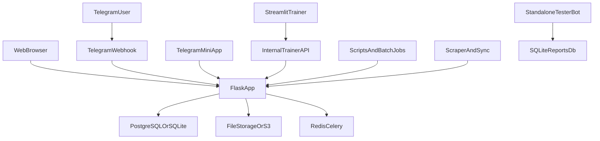

# Системный обзор

## 1. Архитектурный стиль

Проект — это крупное серверное приложение на Flask с модульной разбивкой по blueprints. Вокруг него существуют тесно связанные подсистемы:

- отдельный Streamlit-тренажёр;
- production Telegram webhook и Mini App;
- отдельный Telegram-бот для репортов тестировщиков;
- batch/sync/scanner слой в `scripts/` и `scraper/`.

Это не классическая микросервисная архитектура: основная логика, модели данных и интеграции сосредоточены в одном репозитории и в значительной степени в одном приложении.

## 2. Верхнеуровневые контуры

## 3. Основной web-контур

### Request flow

1. `wsgi.py` создаёт приложение через `app.create_app()`.
2. `app/__init__.py` инициализирует конфиг, DB, login manager, CSRF, limiter, storage, audit и logging.
3. Затем регистрируются blueprints, error handlers, Jinja filters, SocketIO и фоновые workers.
4. Пользовательские запросы обрабатываются blueprint-модулями, которые в свою очередь опираются на модели из `core/db_models.py`, shared utilities и сервисные слои.

### Ключевые архитектурные центры тяжести

- `app/__init__.py` — orchestration point всего web runtime.
- `core/db_models.py` — единый источник истины по модели данных.
- `app/admin/`, `app/api/`, `app/lessons/`, `app/trainer/`, `app/telegram/` — самые насыщенные и чувствительные контуры.

## 4. Группы модулей

### Учебный и продуктовый слой

- `students`
- `lessons`
- `assignments`
- `schedule`
- `task_generator`
- `theory`
- `courses`
- `groups`
- `library`
- `billing`

Это пользовательский и учебный контур платформы: управление процессом обучения, контентом и результатами.

### Административный и операционный слой

- `admin`
- `remote_admin`
- `api`
- `qa`
- `chief_tester`
- `notifications`
- `reminders`

Этот слой закрывает управление системой, поддержку, QA, диагностику и сервисные сценарии.

### Интеграционный слой

- `trainer`
- `telegram`
- `uploads`
- `storage`
- `analytics`
- `tasks`

Здесь живут внешние каналы взаимодействия и cross-cutting сервисы.

## 5. Данные и хранение

### Основная БД

Основной target production-контура — PostgreSQL. Для локальной разработки допускается SQLite fallback. Конфигурация выбирается в `app/__init__.py` через `DATABASE_URL`, `DATABASE_EXTERNAL_URL`, `POSTGRES_URL`, `DEMO_DATABASE_URL`.

### Файлы и загрузки

Есть два уровня хранения:

- локальные upload directories;
- S3/MinIO-compatible storage через storage layer.

Для файлов важны конфигурации:

- `AVATAR_UPLOAD_ROOT`
- `COVER_UPLOAD_ROOT`
- `THEORY_UPLOAD_ROOT`
- `TASK_ATTACHMENTS_ROOT`
- `ANSWER_ATTACHMENTS_ROOT`
- `S3_ENDPOINT_URL`
- `S3_ACCESS_KEY`
- `S3_SECRET_KEY`
- `S3_BUCKET`

### Background processing

В репозитории присутствуют оба подхода:

- thread-based workers внутри Flask factory;
- отдельный Celery runtime.

Это означает, что эксплуатация должна чётко различать in-process фоновые задачи и внешние worker-процессы.

## 6. Trainer-контур

`trainer_app/` — отдельный Streamlit UI, но не полностью самостоятельный сервис:

- он общается с Flask по `internal/trainer` API;
- использует shared secret для доверенного обмена;
- зависит от части кода монолита и общей предметной модели;
- логически является отдельным интерфейсом, а не отдельным доменным сервисом.

## 7. Telegram-контур

В репозитории есть два разных Telegram-направления.

### Production Telegram integration

- `app/telegram/*`
- `urep_bot/*`

Это основная интеграция платформы с Telegram. В production работает webhook-модель внутри Flask.

### Standalone tester-report bot

- `telegram_bot/*`

Это отдельный operational bot, не встроенный в web-приложение и не использующий основную предметную БД как центральный источник истины.

## 8. Скрипты и batch-контур

`scripts/` и `scraper/` образуют отдельный operational слой репозитория.

Типовые сценарии:

- начальная настройка и bootstrap;
- миграции и data-fixes;
- синхронизация контента и task bank;
- диагностика и сравнение сред;
- экспорт/импорт;
- incident-specific cleanup.

Это один из главных источников риска, потому что рядом лежат как безопасные проверочные утилиты, так и опасные prod-sensitive скрипты.

## 9. Документационные и архитектурные риски

### Высокий риск

- устаревшие упоминания монолитного `app.py`;
- смешение production-контура с legacy-заметками;
- отсутствие чёткого разделения между канонической docs и историческими планами;
- наличие dormant blueprints и каталогов, чья роль неочевидна без аудита.

### Средний риск

- примерный, а не канонический `docker-compose.example.yml`;
- deploy-only GitHub Actions без test/lint CI;
- coexistence thread-workers и Celery без единого эксплуатационного описания.

## 10. Практический вывод для сопровождения

Если нужно быстро понять систему, идите в таком порядке:

1. `README.md`
2. `docs/PROJECT_STRUCTURE.md`
3. `docs/PROJECT_STRUCTURE_FULL.md`
4. `app/__init__.py`
5. `core/db_models.py`
6. профильный модуль из `docs/modules/`
