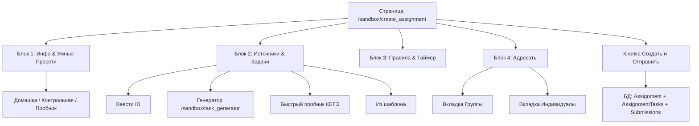

# 🛠️ Модуль «Конструктор Создания Новых Работ» (`/sandbox/create_assignment`)

Полнофункциональный конструктор формирования домашних заданий, контрольных работ и пробников КЕГЭ с умными пресетами, 4 источниками задач, управлением адресатами и связкой с Умным Генератором.

---

## 🏗️ Архитектура и Структура Блоков

---

## ⚙️ Логика Умных Пресетов (Блок 1)

1. **🏠 Домашнее задание (`homework`):**
   - Таймер сброшен (без лимита).
   - Чекбокс «Разрешить последовательную сдачу по 1 задаче» **включен** и доступен для изменения.
   - Попыток сдачи по умолчанию: `3`.

2. **📝 Контрольная работа (`test`):**
   - Таймер сброшен.
   - Чекбокс последовательной сдачи **снят** и **заблокирован**.
   - Попыток сдачи по умолчанию: `1`.

3. **⚡ Пробник КЕГЭ (`exam`):**
   - Ограничение времени автоматически устанавливается в **`235` минут**.
   - Чекбокс последовательной сдачи **снят** и **заблокирован**.
   - Попыток сдачи по умолчанию: `1`.

---

## 📥 4 Источника Задач & Управление Заданиями (Блок 2)

- **Ввести ID:** Модальное окно ввода ID задач через запятую или пробел (`1, 2, 105`).
- **Генератор:** Автоматически сохраняет черновик работы (`draft_id`) и перенаправляет на `/sandbox/task_generator?assignment_id=DRAFT_ID`. На странице генератора отображается плашка контекста и кнопка **«← Вернуться к созданию работы»**.
- **Быстрый пробник:** В один клик подгружает 27 задач КЕГЭ (по 1 случайной каждого типа №1–27).
- **Из шаблона:** Модалка подгрузки готовых наборов.
- **Список задач (Accordion):** Карточки с возможностью перетаскивания / перемещения `↑ / ↓`, инлайн-редактированием максимального балла, удалением и просмотром KaTeX условий.

---

## 🎓 Применение Настроек и Жизненный Цикл Работы у Ученика (`task_detail.html` & `tasks.html`)

1. **🕒 Корректность Дедлайнов и Таймзон (UTC+7):**
   - Строгий парсинг ISO-строк из `datetime-local` с привязкой к локальному часовому поясу пользователя (UTC+7, Красноярск/Томск/Сибирь) при создании работы.
   - Умное форматирование `format_deadline_display`: если дедлайн на текущие сутки пользователя — выводится **«Сегодня, HH:MM»** (а не «Завтра»).
   - На карточках сданных работ дедлайн заменяется плашкой **«Сдано DD.MM в HH:MM»**.

2. **💾 Безопасная Авто-Сдача при Истечении Таймера (`is_auto_submit: true`):**
   - При `remaining_seconds <= 0` JS-скрипт не совершает сухой редирект: считывает все введенные `<input>` значения из DOM и отправляет POST `/sandbox/api/task_detail/<id>/submit_assignment` с `{ answers: answersDict, is_auto_submit: true }`.
   - Бэкенд сохраняет ответы в БД, вычисляет итоговый бал и переводит работу в статус `COMPLETED` (для ДЗ) или `UNDER_REVIEW` (для Пробников/Тестов).
   - После успешного ответа сервера выводится 3D Тост: *"⏰ Время вышло! Ваши ответы были автоматически сохранены и отправлены на проверку"* с перенаправлением на список работ.

3. **🏷️ Динамические 3D-Бейджи и Статусы Карточек (`/sandbox/tasks`):**
   - **Бейджи типов (`assignment_type`):**
     - `exam` → **«ПРОБНИК КЕГЭ»** (`bg-indigo-100 text-indigo-800 border-indigo-200`)
     - `test` → **«КОНТРОЛЬНАЯ РАБОТА»** (`bg-amber-100 text-amber-800 border-amber-200`)
     - `homework` → **«ДОМАШНЕЕ ЗАДАНИЕ»** (`bg-sky-100 text-sky-800 border-sky-200`)
   - **Бейджи статусов (`submission.status`):**
     - `NOT_STARTED` → **«НЕ НАЧАТО»** (Серый 3D-бейдж)
     - `IN_PROGRESS` → **«В ПРОЦЕССЕ»** (Синий 3D-бейдж)
     - `UNDER_REVIEW` → **«НА ПРОВЕРКЕ»** (Янтарный 3D-бейдж)
     - `COMPLETED` → **«ПРОВЕРЕНО»** (Изумрудный 3D-бейдж)

4. **🔄 Механика Повторных Попыток (`max_attempts`):**
   - Если статус работы `COMPLETED` или `UNDER_REVIEW` и `attempt_count < max_attempts`: отображается 3D-кнопка **«🔄 Пройти повторно (Попытка X из Y)»**.
   - Нажатие вызывает POST `/sandbox/api/assignment/<id>/start_new_attempt`, обнуляющий поля ввода для новой попытки с сохранением истории.

5. **✍️ Фоновое Авто-Сохранение Черновика (Draft Auto-Save):**
   - Каждые 30 секунд + по событию `blur` на инпутах ответов отправляется фоновый AJAX-запрос `/sandbox/api/task_detail/<id>/save_draft`.
   - Ответы подгружаются автоматически при повторном открытии страницы.

---

## 🛠️ Страница «Детали и редактирование работы» преподавателя (`/sandbox/assignment/<id>/details`)

1. **📜 Маршрут и API:**
   - `GET /sandbox/assignment/<id>/details` — подгружает данные работы, задач и очередь сдачи учеников в безопасный JSON-контейнер `<script id="assignment-details-data">`.
   - `POST /sandbox/api/assignment/<id>/update` — сохраняет измененные параметры работы, дедлайны (UTC+7), ограничения времени, баллы за задачи и эталонные ответы (`answer_override`).
   - `POST /sandbox/api/assignment/<id>/duplicate` — создаёт дубликат работы со статусом `draft`.
   - `POST /sandbox/api/assignment/<id>/archive` — отправляет работу в архив.
   - `POST /sandbox/api/assignment/<id>/add_random_task` & `/remove_task/<at_id>` — управление составом задач в работе.

2. **🎨 Стилистика BooStudy UI Canon (1400px):**
   - Блок статистики сдачи (прогресс-бар + 4 карточки: *Нужно проверить, В процессе, Просрочено, Сдано вовремя*).
   - Основные настройки (поля ввода, правила проверки, выбор типа работы и ограничений).
   - Состав работы с полями для изменения баллов и переопределения эталонных ответов.
   - Таблица очередности сдачи учеников с фильтром поиска и статусами.
   - Закрепленный 3D Save Footer с кнопкой «💾 Сохранить параметры работы».
   - Каноничные 3D-модалки подтверждения дублирования и архивации (0 вызовов `confirm()` / `alert()`).

